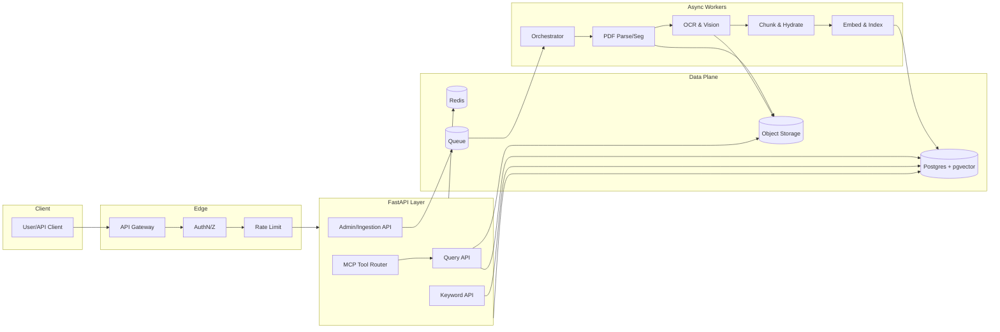

# **RAG for Lab Manuals — Full Implementation Guide (Direct Client Delivery)**

> **Goal:** Build a production-ready, low-latency, multi-tenant Retrieval-Augmented Generation system for lab instrument manuals (text, tables, diagrams, links) with keyword + semantic search, grounded answers, precise citations (page + region), and MCP-ready API tools. Supports up to **30 labs** with per-tenant isolation.

---

## **0. Global Requirements & SLAs**

**Tenancy & Isolation**

* Per-lab isolation via Postgres Row-Level Security (RLS) and object storage prefixing.
* No cross-lab data leakage, verified by automated RLS tests.

**Document Limits**

* ≤ 50 manuals per instrument, 2–20 MB each.
* Labs: 1–100+ instruments.

**Search Modes**

* Natural language (semantic) + keyword operator search.

**Citations**

* Must return: `pdf_uri`, `page_number`, `bbox` (if available), `section_path`.

**Latency Targets**

* Retrieval: **P50 ≤ 400 ms**, **P95 ≤ 900 ms**
* End-to-end answer: **P50 ≤ 1.2 s**, **P95 ≤ 2.5 s** (streaming enabled)

**Accuracy / Hallucination Control**

* Strict grounding in retrieved content; refuse if evidence < threshold.
* Always include ≥ 2 citations when possible.

**Scalability**

* Optimized for up to 30 labs now; architecture supports horizontal scaling.

---

## **1. Execution Order (First Deployment)**

1. Apply SQL migrations in `/infra/migrations`.
2. Deploy Postgres + pgvector, Redis, Object Storage (MinIO or S3).
3. Deploy ingestion workers (`make dev.up`).
4. Register & ingest 1 manufacturer manual + 1 lab SOP for validation.
5. Deploy API layer (FastAPI).
6. Run retrieval smoke tests with keyword + semantic queries.
7. Validate RLS isolation.
8. Conduct latency, accuracy, and citation correctness tests.

---

## **2. System Architecture**

**Reference: Figure 1 — High-Level System Architecture**



---

## **3. Modules (AI-Executable Format)**

### **3.1 Document Ingestion Pipeline**

Handles both **manufacturer manuals** and **lab documents**. Controlled by `source_type` parameter.

---

#### **Step 1 — Document Registration**

**INPUT**

* `lab_id`: UUID
* `source_type`: `'manufacturer'` or `'lab'`
* `instrument_id` or `instrument_model`
* `title`, `document_type`, `version`
* `file`: PDF

**PROCESS**

1. Compute `content_hash` (SHA-256) for deduplication.
2. Insert into `documents` table with metadata (lab, type, model, version, source).
3. Store PDF in `OBJ` at path:

   ```
   s3://bucket/{lab_id}/{document_id}/{filename}
   ```

**OUTPUT**

* `document_id` (UUID)
* Status: `"registered"`

**FAILURE MODES**

| Failure       | Detection            | Recovery                                      |
| ------------- | -------------------- | --------------------------------------------- |
| Duplicate PDF | `content_hash` match | Return existing `document_id`, skip ingestion |
| Invalid PDF   | Parse error          | Reject with `400`                             |

---

#### **Step 2 — PDF Parsing & Structure Extraction**

**INPUT**

* `document_id`
* PDF from object storage

**PROCESS**

1. Parse Table of Contents, heading levels, intra-doc links.
2. Extract text with page anchors.
3. Extract tables → `markdown_table` + `table_json`.
4. Extract images → PNG/JPEG; store with `page_number` + `bbox`.

**OUTPUT**

* Populated `sections` table
* Raw extracted content in staging

**FAILURE MODES**

| Failure            | Detection    | Recovery                               |
| ------------------ | ------------ | -------------------------------------- |
| Missing text layer | OCR required | Send pages to OCR worker               |
| Table parse error  | Empty CSV    | Log warning, fallback to Markdown only |

---

#### **Step 3 — OCR & Vision (Conditional)**

**INPUT**

* Pages without text layer
* Extracted images

**PROCESS**

1. OCR pages with layout preservation.
2. Caption extracted diagrams (image caption model).
3. Save to `images` table with `alt_text`.

**OUTPUT**

* OCR text for missing pages
* Captions stored in metadata

**FAILURE MODES**

| Failure              | Detection          | Recovery                                                    |
| -------------------- | ------------------ | ----------------------------------------------------------- |
| OCR confidence < 0.8 | Model output score | Retry with higher resolution; if still low, flag for review |

---

#### **Step 4 — Chunking & Hydration**

**INPUT**

* Clean text, tables, captions

**PROCESS**

1. Chunk text by semantic boundary (600–1200 tokens).
2. Record `page_start`, `page_end`, `bbox` if available.
3. Tag chunks (safety, calibration, etc.).
4. Link to `section_id` for hierarchy.

**OUTPUT**

* Chunks in `chunks` table with metadata

---

#### **Step 5 — Embedding & Indexing**

**INPUT**

* Chunks with text, table markdown, image captions

**PROCESS**

1. Generate embeddings per chunk.
2. Upsert into `chunks` table with embedding vector.
3. Refresh ANN index.

**OUTPUT**

* Updated vector index, ready for retrieval

---

### **3.2 Retrieval & Answering Engine**

#### **Step 1 — Query Processing**

**INPUT**

* `query`: string
* Optional `filters` (instrument, source, doc\_type)
* Optional keyword operators

**PROCESS**

1. Intent classification → retrieval scope.
2. Hybrid retrieval:

   * ANN vector search (top-K=80)
   * Keyword search (BM25/FTS)
3. MMR diversification.
4. Cross-encoder rerank to top-N=12.

**OUTPUT**

* Ranked candidate chunks

**FAILURE MODES**

| Failure         | Detection         | Recovery                  |
| --------------- | ----------------- | ------------------------- |
| Zero results    | No candidates     | Ask clarifying question   |
| Single-doc bias | >80% from one doc | Force diversity in rerank |

---

#### **Step 2 — Grounded Answer Synthesis**

**INPUT**

* Top-N chunks

**PROCESS**

1. Extract up to 3 direct quotes with citations.
2. Compose answer strictly from extracted quotes.
3. Include citations inline.

**OUTPUT**

```json
{
  "answer": "...",
  "citations": [...],
  "quotes": [...]
}
```

---

## **4. Data Model Summary**

(DDL remains as in your original but with explicit metadata schemas for JSONB fields.)

---

## **5. Security & Isolation**

* RLS on all content tables.
* Object storage prefix isolation.
* PII redaction hooks in lab ingestion.

---

## **6. Observability**

* Metrics: ANN latency, rerank latency, cache hit rate.
* Logs: All queries + top-K doc IDs.
* Traces: Retrieval → Rerank → Synthesis.

---

## **7. Acceptance Criteria**

* Ingest 500 PDFs in ≤ 2 hours.
* ≥ 90% answerable queries return ≥ 2 citations.
* P95 latency ≤ 2.5 s at 5 RPS/tenant.
* Zero cross-tenant leaks verified.

